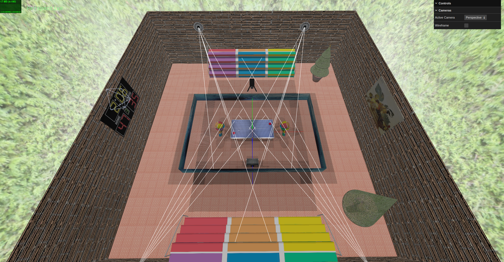

# SGI 2023/2024 - TP2

## Group T02G01

| Name             | Number    | E-Mail             |
| ---------------- | --------- | ------------------ |
| Pedro Jorge da Rocha Balazeiro         | 202005097 | up202005097@up.pt                |
| Rúben Costa Viana        | 202005108 | up202005108@up.pt                |

----
## Project information
- Scene
  - In our interactive graphics systems project, we have created a indoor table tennis tournament. It has benches, table tennis table, 2 robots playing the game, two racquets, an advertisement screen surrounding the table, a tree (to celebrate christmas time), a painting (which allow us to view the mipmap at work), a polygon on the othe side of the wall, which have a brick rugosity and finnally a score board in the wall.
- We also have a toggle button in the GUI that allow us to change between wireframe and solid textures.

----
## Issues/Problems

- Some problems implementing the LODs part in the builder.
