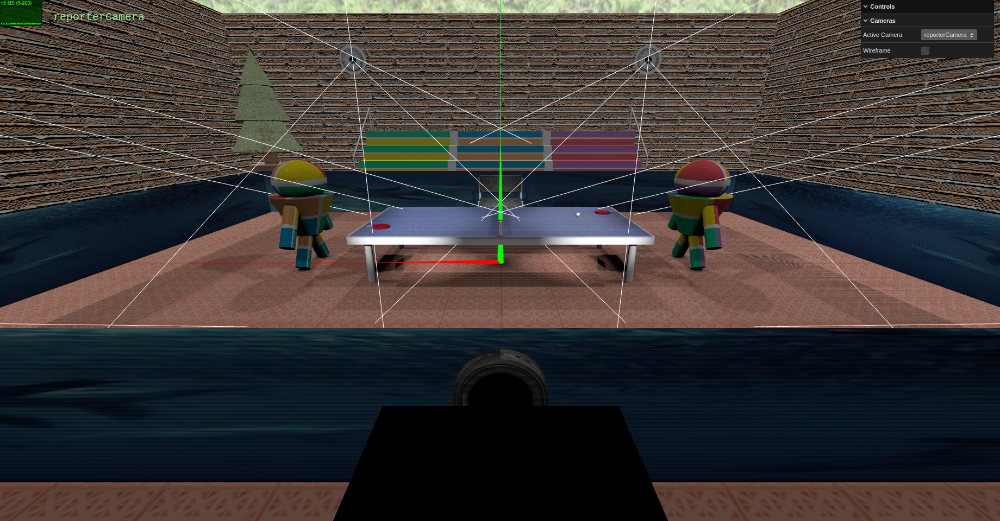
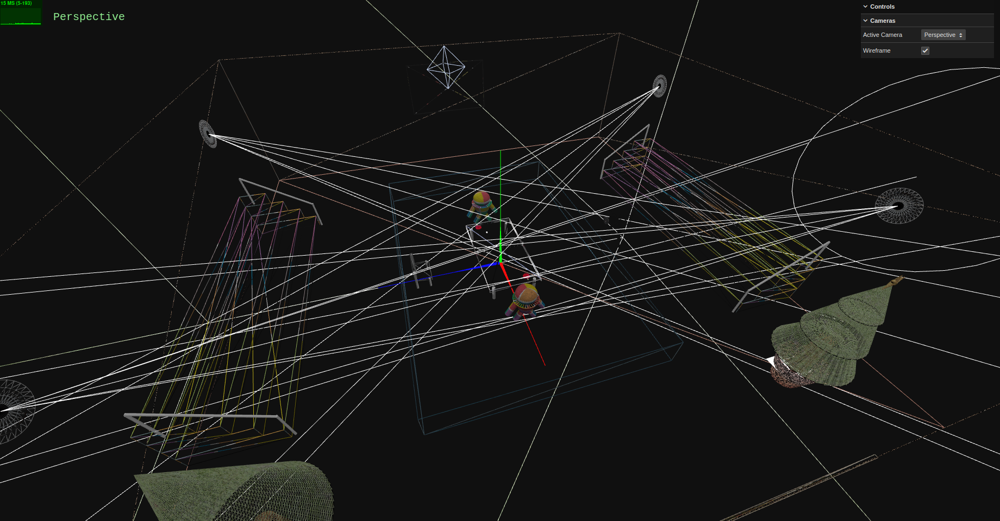

# SGI 2023/2024 - TP2

## Group T02G01

| Name             | Number    | E-Mail             |
| ---------------- | --------- | ------------------ |
| Pedro Jorge da Rocha Balazeiro         | 202005097 | up202005097@up.pt                |
| Rúben Costa Viana        | 202005108 | up202005108@up.pt                |

----
## Project information

- In our interactive graphics systems project, we've designed an indoor table tennis tournament environment. It includes various elements such as benches for seating, a table tennis table at the center, two robotic players engaged in the game, two rackets, a ball, and an advertising screen encircling the table (displaying a video). Additionally, we've integrated two trees to capture the festive Christmas spirit, one of them specifically included to showcase the effectiveness of LODs (Level of Detail). The scene incorporates a painting that effectively demonstrates the application of mipmaps. Furthermore, there are four polygons serving as pavilion lights on the side walls, featuring a textured brick surface (bump-map textures). Lastly, we've installed a scoreboard on the wall to keep track of the game's progress and scores.
- Additionally, our GUI includes a toggle button that enables us to switch between displaying wireframe and solid textures. We've incorporated additional cameras to present various perspectives of the scene.

----
## Issues/Problems

- We encountered a few minor hiccups, mostly due to distractions, but managed to resolve them later on. We aimed to implement additional features like enhancing the 3D modeling section, refining our table tennis scene with more elements and further improvements were intended for the GUI, but due to time constraints, we concluded with this version. Overall, we're proud to have achieved our initial objectives, yet we're eager to push further. This project has immense potential for learning, and we're motivated to explore more avenues for growth and development.